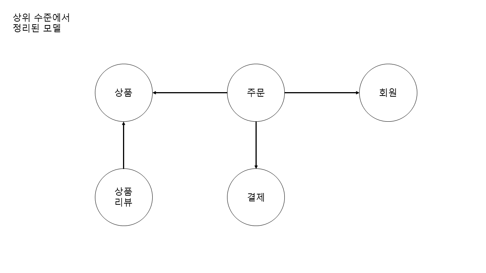
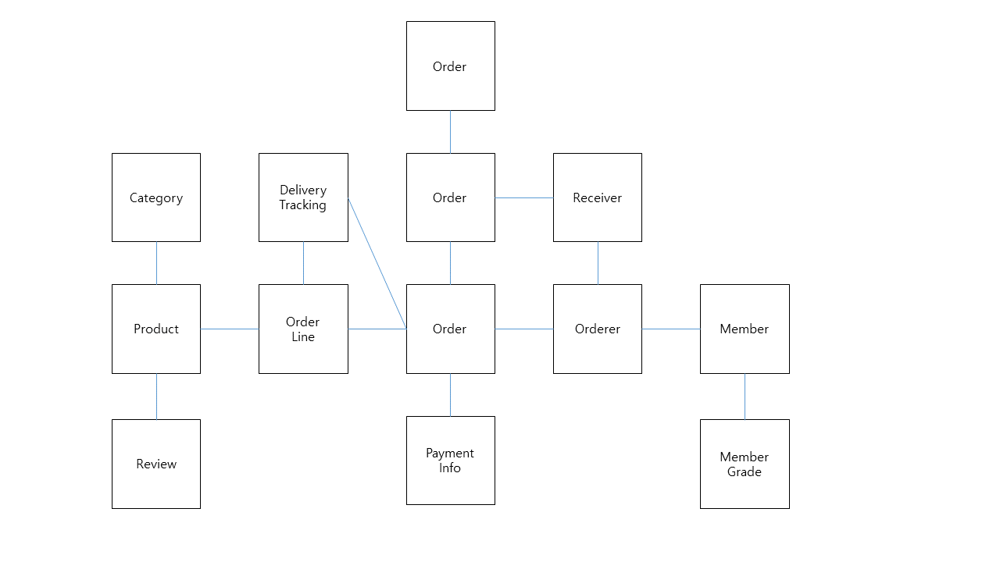
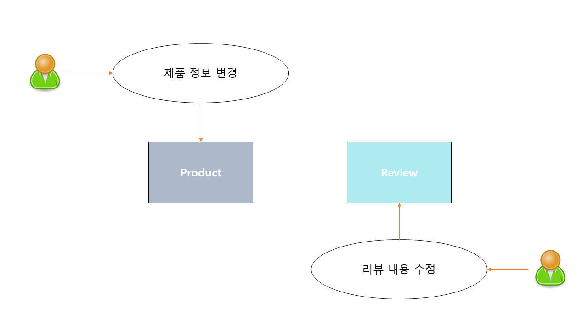

# 애그리거트 개요  

  
    
상위 수준에서 모델을 정리하면 복잡한 도메인 모델의 관계를 이해하는데 도움이된다.          
그리고 명확한 관계 이해를 통해 전체 모델을 망가뜨리지 않으면서 추가 요구사항을 반영할 수 있다.       

  
            
그런데 만약, **`상위 수준 모델`에 대한 이해 없이 `객체 단위`만 바라보게 된다면? 🤔**               
전반적인 구조나 큰 수준에서 도메인간의 파악이 어려워지므로 **코드의 변경이나 확장을 기피하게 되며**     
**도메인 전문가와 대화를 나누고 코드를 분석해야** 비로소 상위 수준에서 모델간의 관계가 이해될 것이다.             
그리고 이러한 문제는 **도메인 객체 모델이 복잡하다면 이러한 문제는 더욱 심각해진다.**                 
                 
이를 해결하기 위해서 `모델 관계`에 **애그리거트를 적용해야한다.**                
            
# 애그리거트 
`애그리 거트`는 **복잡한 도메인을 이해하고 관리하기 쉬운 단위로 만들어주는 단위 같은 역할을 한다.**       
관련된 객체를 하나의 집합(군)으로 묶어주며        
애그리거트 단위로 바라보면 좀 더 상위 수준에서 도메인 모델간의 관계를 파악하기 쉬워진다.       
      
  
  
애그리거트를 이용하게 된다면 모델간의 관계를 개별 모델 수준뿐만 아니라 상위 수준에서도 이해하기 쉽다.      

### 애그리거트와 일관성   

```java
public interface OrderRepository {
    public Order findByNumber(OrderNumber number);
    public void save(Order order);
    public void delete(Order order);
}
```   
  
애그리거트는 **일관성을 관리하는 기준이 되기도 한다.**      
애그리거트 단위로 일관성을 관리하기 때문에, **복잡한 도메인을 단순한 구조로 만들어준다.**      
복잡도가 낮아지는 만큼 **도메인 기능을 확장하고 변경하는 데 필요한 노력도 줄어든다.**        

### 애그리거트와 라이프 사이클  
애그리거트는 관련된 모델을 하나로 모은 것이기 때문에     
**한 애그리거트에 속한 객체는 유사하거나 동일한 라이프사이클을 갖는다.**         

```java
 public class Order {
    private List<OrderLine> orderLines;
    private Orderer orderer;
    private ShippingInfo shippingInfo;
    
    ... // 메서드는 생략 
}
```

`주문` 애그리거트를 만들려면 `Order`, `OrderLine`, `Orderer`와 같은 관련 객체를 함께 생성해야한다.    
이와 같은 관련 객체를 만들지 않는 그런 경우는 없다.       
물론, 도메인 규칙에 따라 최초 주문 시점에 일부 객체를 만들 필요가 없는 경우도 있지만       
**대부분 애그리거트에 속한 구성요소는 함께 생성하고 함께 제거한다.**       
      

```java
 public class Order {
    private final List<OrderLine> orderLines;
    private final Orderer orderer;
    private ShippingInfo shippingInfo;  
    
    public Order(List<OrderLine> orderLies, Orderer orderer) {
        this.orderLines = orderLines;
        this.orderer = orderer;
        this.shippingInfo = ShippingInfo.Ready;                         // 디폴트 
    }
     
}
```
추가로, 객체의 참조 시점과 별개로 변수가 선언되어 있는데          
앞서 언급했듯이 특수한 경우는 객체를 먼저 만들지 않아도 된다고 한다하더라도     
`Null`값을 참조시키도록 하는 것보다, **`준비 클래스`나 `default 클래스`를 만들어두는게 낫다.**      
    
### 애그리거트와 경계   
애그리거트는 경계를 갖고 있어 각각의 애그리거트간의 구분이된다.           
즉, **한 애그리트에 속한 객체는 다른 애그리거트에 속하지 않는다.**             
애그리거트는 독립된 객체 집합(군)이며,     
**자기 자신을 관리할 뿐 다른 애그리거트를 관리하지않는다.**               
    
* 주문 **--->** 배송지 변경, 주문 상품 개수 변경 
* 주문 **-X->** 회원의 비밀 번호 변경 
     
경계를 설정할 때 기본이 되는 것은 **`도메인 규칙`과 `요구사항`이다.**        
**`도메인 규칙`에 따라 함께 생성되는 구성요소는 한 애그리거트에 속할 가능성이 높다.**         
또한, **함께 변경되는 빈도가 높은 객체는 한 애그리거트에 속할 가능성이 높다.**      
             
예를 들면 '주문'시점에 같이 생성되는 '상품 개수', '주문자 정보' 등등이 있으며         
`OrderLine의 주문 상품 개수를 변경`하면 도메인 규칙에 따라 `Order의 총 주문 금액 또한 새롭게 계산`해야한다.       
   
### 애그리거트간의 경계 주의점
흔히, `A가 B를 갖는다.`로 설계할 수 있는 요구사항이 있다면 `A와 B`를 한 애그리거트로 묶어서 생각하기 쉽다.     
하지만, `A가 B를 갖는다`로 해석할 수 있더라도 `A와 B`가 한 애그리트에 속하다는 것은 아니다.     

```java
public class Product {
    private List<Review> reviews = new ArrayList<>(); // 단순히 연관 관계를 가진 객체로 보면 될 것 같다.   
}   
// 상품은 여러 리뷰를 가진다.   
// 리뷰는 하나의 상품에 속한다.     
// 이를 객체로 표현했을 때 위와 같아서 이렇게 표현했습니다.     
```   
        
`상품리뷰`를 기준으로,   
상품 상세 페이지와 함께 리뷰 내용을 보여줘야한다는 요구사항이 있다면          
`Product 엔티티`와 `Review 엔티티`가 한 애그리거트에 속한다고 생각할 수 있다.            
하지만 이 둘은 서로 다른 애그리거트에 속하고 있다.       
      
  
   
1. **`Product 엔티티`와 `Review 엔티티`는 함께 생성되지 않고 함께 변경되지도 않는다.**           
2. **`Product 엔티티` 변경 주체는 상품 담당자라면 `Review 엔티티` 변경 주체는 고객이다.**     
3. **`Product 엔티티` 변경이 일어나도 `Review 엔티티`는 변경이 일어나지 않으며 반대도 마찬가지이다.**   
         
위와 같은 이유로 둘은 서로 다른 애그리거트에 속하다는 것을 알 수 있다.        
          
처음 도메인 모델을 만들기 시작하면 큰 애그리거트로 보이는 것들이 많지만     
**도메인에 대한 경험이 생기고 도메인 규칙을 제대로 이해할 수록 실제 애그리거트의 크기는 줄어들게 된다.**       
다수의 엔티티가 한 개의 엔티티 객체를 갖는 경우가 많으며, 2개 이상의 엔티티로 구성되는 경우는 드물게 존재한다.     
    
# 애그리거트 루트   
주문 애그리거트는 다음을 표현한다.    
    
* 총 금액인 int totalAmounts 를 갖고 있는 Order 엔티티    
* 개별 구매 상품의 갯수인 quantity와 금액인 price 를 갖고 있는 OrderLine 벨류      
     
만약, 구매할 상품의 개수를 변경하고자 한다면 아래와 같은 과정을 거쳐야한다.   

* `OrderLine`의 `quantity`를 변경해야 한다.  
* `Order`의 `totalAmounts`도 변경해야 한다.       
         
그렇지 않으면 `주문 총 금액은 개별 상품의 주문 개수 X 가격의 합이다`라는 도메인 규칙을 어기고 데이터 일관성이 깨진다.     
즉, **도메인 규칙을 지키려면 애그리거트에 속한 모든 객체가 `정상 상태`를 가져야한다.**     
          
애그리거트에 속한 모든 객체가 일관된 상태를 유지하려면 **애그리거트 전체를 관리할 주체가 필요하다.**     
그리고 **애그리거트 전체를 관리하고 책임을 지는 객체가 바로 `애그리거트 루트`이다.**      

```java
 public class Order {                                               // 애그리거트 루트
    private final List<OrderLine> orderLines;
    private final Orderer orderer;
    private ShippingInfo shippingInfo;  
    
    public Order(List<OrderLine> orderLies, Orderer orderer) {
        this.orderLines = orderLines;
        this.orderer = orderer;
        this.shippingInfo = ShippingInfo.Ready;                   
    }
     
}
```

`애그리거트 루트 엔티티`는 애그리거트의 대표 엔티티로        
`애그리거트에 속한 객체`는 **애그리거트 루트 엔티티에 직접 또는 간접적으로 속한다.**         
   
## 도메인 규칙과 일관성   
**애그리거트 루트**가 단순히 애그리거트에 속한 객체를 포함하는 것으로 끝나지는 않는다.      
애그리거트 루트의 핵심 역할은 **애그리거트의 일관성이 깨지지 않도록 하는것이다.**   
이를 위해 **`애그리거트 루트`는 애그리거트가 제공해야할 도메인 기능을 구현한다.(메서드로 구현)**          
            
애그리거트 루트가 제공하는 메서드는     
도메인 규칙에 따라 애그리거트에 속한 객체의 일관성이 깨지지 않도록 구현해야한다.    
    
```java
public class Order {

    public void changeSippingInfo(ShippingInfo newShippingInfo) {
        verifyNotYetShipped();
        setShippingInfo(newShippingInfo);
    }
    
    privae void verifyNotYetShipped() {
        if(state != OrderState.PAYMNET_WAITING && state != OrderStae.WAITING) {
            throw new IllegalStateException("aleady shipped");
        }
    }
            
}
```
`배송이 시작되기전까지만 배송지 정보 변경 가능하다.`는 도메인 규칙이 있다면      
해당 규칙에 따라 배송 시작 여부를 확인하고 변경 가능한 경우에만 배송지 정보를 변경해야한다.       
      
### 일관성을 지키기 위한 주의점
#### 일관성을 깬 예시     
애그리거트 루트가 아닌 다른 객체가 애그리거트에 속한 객체를 직접 변경하면 안된다.     
이는 애그리거트 루트가 강제하는 규칙을 적용할 수 없어 모델의 일관성을 깨는 원인이 된다.       

```java
@Service
@RequiredArgsConstructor
public class SampleService {
    
    private final SampleRepository sampleRepository;
    
    public void logic(Long orderId) {
        Order order = sampleRepository.findById(orderId);
        
        ShippingInfo si = order.getShippingInfo();
        si.setAddress(newAddress);
    }
    
}
```

위 코드는 애그리거트 루트인 `Order`에서 `ShippingInfo` 를 가져와 직접 정보를 변경하고 있다.  
이는 `주문상태에 따라 값을 바꿀 수 있다`는 업무 규칙을 무시하고      
DB 테이블에서 직접 데이터를 수정하는 것과 같은 결과를 만든다.       
즉, 논리적인 데이터 일관성이 깨지게 되는 것이다.     

```java
    public void logic(Long orderId) {
        Order order = sampleRepository.findById(orderId);
        
        ShippingInfo si = order.getShippingInfo();
        if(state != OrderState.PAYMENT_WAITING && state != OrderState.WAITING) {
            throw new IllegalArgumentException();
        }   
        si.setAddress(newAddress);
    }
```
  
일관성을 지키기 위해 `상태 확인 로직`을 응용 서비스에 구현할 수도 있지만,    
이렇게 되면 동일한 검사 로직을 여러 응용 서비스에서 중복해서 구현할 가능성이 높아져 상황을 악화한다.     
  
#### 일관서을 

불필요한 중복을 피하고 애그리거트 루트를 통해서만 도메인 로직을 구현하게 만들려면      
도메인 모델에 대해 다음 두 가지를 습관적으로 적용해야 한다.      

* 단순히 필드를 변경하는 `set 메서드`를 공개범위로 만들지 않는다.     
* 벨류 타입은 불변으로 구현한다.     

### set 메서드를 공개범위로 만들지 않는다.   
`public set 메서드`는 피해야한다.              
필드에 값을 할당하는 것만으로 끝나는 경우가 많으며, 많아야 `null`인지를 검사하기 때문이다.   

```java
public void setName(String name) {
    this.name = name;
}
```
`public set 메서드`는 **중요 도메인의 의미나 의도를 표현하지 못하고**        
**도메인 로직이 도메인 객체가 아닌 도메인 외부 영역을 분산되게 만드는 원인을 제공한다.**          
이는 곧, 도메인 로직이 한 곳에 응집되지 않게 만드므로 유지보수 및 코드 분석에 많은 시간을 들이게 만든다.   
  
사실, `public set 메서드`를 사용하지 않기만 해도 일관성이 깨질 가능성은 매우 줄어든다.   
또한, `private set 메서드` 또한 `changePassword()`와 같이 의미를 갖는 메서드를 사용하는 것이 좋다.   

## 벨류 타입은 불변으로 구현한다.      
벨류 객체의 값을 변경할 수 없으면     
애그리거트 루트에서 벨류 객체를 구해도 값을 변경할 수 없기에       
애그리거트 외부에서 벨류 객체의 상태를 변경할 수 없게 된다.       

```java
@Service
@RequiredArgsConstructor
public class SampleService {
    
    private final SampleRepository sampleRepository;
    
    public void logic(Long orderId) {
        Order order = sampleRepository.findById(orderId);
        
        ShippingInfo si = order.getShippingInfo();
        si.setAddress(newAddress); // ShippingInfo 벨류 객체가 불변이면 이 코드는 컴파일 에러!  
    }
}
```   

애그리거트 외부에서 내부 상태를 함부로 바꾸지 못하므로 애그리거트의 일관성이 깨질 가능성이 줄어든다.         
**벨류 객체가 불변이면 벨류 객체의 값을 변경하는 방법은 새로운 벨류 객체를 할당하는 것 뿐이다.**      

```java
public class Order {
    private ShippingInfo shippingInfo;
    
    public void changeShippingInfo(ShippingInfo newShippingInfo) {
        verifyNotYetShipped();    
        setShippingInfo(newShippingInfo);    
    } 
    
    private void setShippingInfo(ShippingInfo newShippingInfo) {
        this.ShippingInfo = newShippingInfo;
    }
}
```
벨류 타입의 내부 상태를 변경하려면 애그리거트 루트를 통해서만 가능하다.     
그러므로, 애그리거트 루트가 도메인 규칙을 올바르게만 구현하면         
애그리거트 전체의 일관성을 올바르게 유지할 수 있다.        
  
**kwj1270 생각 :**    
위 코드도 결국 외부에서 주입받는 형태인다 이게 과연 좋다고 말할 수 있을까요..?     
저는 개인적으로 `changeShippingInfo`또한 내부로 숨기고      
Order의 다른 로직에서 값을 변동시켜주는 것이 좋을 것 같아요    
그리고 `ShippingInfo` 자체적으로 `ShippingInfo`를 반환하는 로직이 있으면 좋을 것 같아요   

```java
public class ShippingInfo {
    
    private String state;
    
    public ShippingInfo(String state) {
        this.state = state;
    }
    
    public ShippingInfo change(newState) {
        return new ShippingInfo(newState);
    }
}
```

## 애그리거트 루트의 기능 구현  
`애그리거트 루트`는 **애그리거트 내부의 다른 객체를 조합해서 기능을 완성한다.**      

**총 주문 금액 계산**
```java
public class Order {
    private Money totalAmounts;
    private List<OrderLine> orderLines;
    
    private void calculateTotalAmounts() {
        int sum = orderLines.stream()
            .mapToInt(o1 -> o1.getPrice() * o1.quantity())
            .sum();
        this.totalAmounts = new Money(sum); // 재사용해도 불변이여서 좋다.    
    }
}
```

**암호 변경을 위한 패스워드 일치 확인**   
```java
public class Member {
    private Password password;
    
    public void changePassword(String currentPassword, String newPassword) { // 현재 패스워드도 외부에서 받는데 왜죠?   
        if(!password.match(currentPassword)) {
            throw new PasswordNotMatchException();
        }
        this.password = new Password(newPassword); 
    }
}
```
     
애그리거트 루트가 구성요소의 상태만 참조하는 것은 아니다.       
**기능 실행을 위임**하기도 하며 필자(kwj1270)은 이 방법을 적극 추천한다.       
     
**Order**
```java
public class Order {
    private OrderLines orderLines;
    
    public void changeOrderLines(List<OrderLine> newLines) {
        orderLines.changeOrderLines(newLines);
        this.totalAmounts = orderLines.getTotalAmounts();
    }
}
```
**OrderLines**
```java
public class OrderLines {
    private List<OrderLines> lines;
    
    pubilc OrderLines(List<OrderLine> lines) {
        this.lines = lines;
    }
    
    public OrderLines changeOrderLines(List<OrderLine> newLines) {
        this.lines = newLines;
    }
    
    public Money totalAmounts() {
        .. // 로직 구현  
    }   
}
```

`애그리거트 루트`에서 실행할 로직을 `OrderLines`내부에 위임을 했다.     
보다 정확히 말하면, 원래 `OrderLines`이 가져야할 `역할`과 `책임`을 명확히 부여했으며   
이로인해 `OrderLines`은 보다 응집도가 높아진 코드가 되었다.   
  
여기서 한 가지 더 가정을 넣으려고 한다.    
**만약, `Order` 가 `getOrderLines()`와 같은 메서드를 제공한다면?**          
아래 코드와 같이 애그리거트 외부에서 OrderLines 기능을 실행할 수 있게 되고 이는 문제다.    


```java
@Service
@RequiredArgsConstructor
public class SampleService {
    
    private final SampleRepository sampleRepository;
    
    public void logic(Long orderId) {
        Order order = sampleRepository.findById(orderId);
        
        OrderLines lines = order.getOrderLines();
        liens.changeOrderLines(newOrderLines);
    }
}
```   
  
결과적으로 버그를 만들기에 `OrderLines` 을 불변으로 구현해야한다.   
`OrderLines`을 불변하게 만들면 구조는 아래와 같다.   
   
**Order**
```java
public class Order {
    private OrderLines orderLines;
    
    public void changeOrderLines(List<OrderLine> newLines) {
        this.orderLines = orderLines.changeOrderLines(newLines);
        this.totalAmounts = orderLines.getTotalAmounts();
    }
}
```
**OrderLines** 
```java
public class OrderLines {
    private List<OrderLines> lines;
    
    pubilc OrderLines(List<OrderLine> lines) {
        this.lines = lines;
    }
    
    public OrderLines changeOrderLines(List<OrderLine> newLines) {
        return new OrderLines(newLines);
    }
    
    public Money totalAmounts() {
        .. // 로직 구현  
    }   
}
```

또한, Order 또한 다른 애그리거트 객체를 `getter로 무부별하게 반환`하지 않도록 해야한다.     
상속 같은 이유로, `private`가 불가능하다면 `protected` 변경 또한 하나의 대안이다.   

## 트랜잭션 범위  
**트랜잭션 범위는 작을수록 좋다.**     
DB 테이블을 기준으로      
한 트랜잭션이 `1개의 테이블을 수정`하는 것과 `3개의 테이블을 수정하는 것`은 성능에서 차이가 발생한다.         
  
* **1 개의 테이블을 수정한다면 :** 트랜잭션 충돌을 막기 위해서 한 개의 테이블의 한 행으로 한정된다.       
* **3 개의 테이블을 수정한다면 :** 3개의 테이블의 행들은 물론, 잠금 대상이 늘어난다.      

잠금 대상이 많아진다는 것은 그만큼 동시에 처리할 수 있는 트랜잭션 개수가 줄어든다는 것을 의미하고      
이는 전체적인 성능(처리량)을 떨어뜨린다.      

동일하게, **한 트랜잭션에서는 한 개의 애그리거트만 수정해야한다.**      
한 트랜잭션에 2개의 애그리거트를 수정하면 트랜잭션 충돌이 발생할 가능성이 더 높아지기 대문에     
한 번에 수정하는 애그리거트 개수가 많아질 수록 전체 처리량이 떨어진게된다.  

**한 트랜잭션에서는 한 개의 애그리거트만 수정해야한다.** 는 말은 사실,   
**애그리거트에서 다른 애그리거트를 변경하지 않는다는 것을 의미한다.**    
(한 애그리거트에서 다른 애그리거트의 상태를 변경하는 기능을 실행하면 안되는 것은 물론, 기능을 만들어서도 안된다.)   

**잘못된 예시**
```java  
public class Order {
    private Orderer orderer;
    
    public void shipTo(ShippingInfo newShippingInfo, boolean useNewShippingAddrAsMemberAddr) {
        verifyNotYetShipped();
        setShippingInfo(newShippingInfo);
        if(userNewShippingAddrAsMemberAddr) {
            // 다른 애그리거트의 상태를 변경하면 안된다. 😢 
            orderer.getCustomer().changeAddress(newShippingInfo.getAddress());
        }
    }
}
```
배송지 정보를 변경하면서 동시에 회원의 주소를 변경하고 있다.       
이는 애그리거트가 자신의 책임 범위를 넘어 다른 애그리거트의 상태까지 관리하는 꼴이된다.       
   
애그리거트는 서로 최대한 독립적이어야 하는데      
한 애그리거트가 다른 애그리거트의 기능에 의존하기 시작하면 애그리거트 간 결합도가 높아지게된다.      
   
결합도가 높아지면 높아질수록 향후 수정 비용이 증가하므로      
애그리거트에서 다른 애그리거트의 상태를 변경하지 말아야한다.   
     
만약, 부득이하게 한 트랜잭션으로 2개 이상의 애그리거트를 수정해야한다면           
애그리거트에서 다른 애그리거트를 직접 수정하지 말고     
아래 코드와 같이 **응용 서비스에서 두 애그리거트를 수정하도록 구현해야한다.**   
   
**응용 서비스에서 두 애그리거트를 수정하는 코드**
```java
public class ChangeOrderService {
    
    @Transactional
    public void changeShippingInfo(OrderId id, ShippingInfo newShippingInfo, boolean useNewShippingAddrAsMemberAddr) {
        Order order = orderRepository.findById(id);
        if(order == null) {
            throw new OrderNotFoundException();
        }
        order.shipTo(newShippingInfo);
        if(useNewShippingAddrAsMemberAddr) {
            order.getOrderer()
                 .getCustomer()
                 .changeAddress(newShippingInfo.getAddress());
        }
    }
}
```
도메인 이벤트를 사용하면, 한 트랜잭션에서 한 개의 애그리거트를 수정하면서도        
동기나 비동기로 다른 애그리거트의 상태를 변경하는 코드를 작성할 수 있는데 이는 나중에 살펴보자      
   
한 트랜잭션에서 한 개의 애그리거트를 변경하는 것을 권장하지만      
다음의 경우에는 한 트랜잭션에서 2개 이상의 애그리거트를 변경하는 것을 고려할 수 있다.     
    
* **팀 표준 :**      
  팀이나 조직의 표준에 따라 사용자 유스케이스와 관련된 응용 서비스의 기능을 한 트랜잭션으로 실행해야하는 경우가 있다.       
  DB가 다른 경우 글로벌 트랜잭션을 반드시 사용하도록 규칙을 정하는 곳도 있다.       
* **기술 제약 :**       
  한 트랜잭션에서 두 개 이상의 애그리거트를 수정하는 대신      
  도메인 이벤트와 비동기를 사용하는 방식을 사용하는데,      
  기술적으로 이벤트 방식을 입힐 수 없는 경우 한 트랜잭션에서 다수의 애그리거트를 수정해서 일관성이 유지되도록 처리해야한다.      
* **UI 구현의 편리 :**     
  운영자의 편리함을 위해 주문 목록 화면에서 여러 주문의 상태를 한 번에 변경하고 싶을 것이다.   
  이 경우 한 트랜잭션에서 여러 주문 애그리거트의 상태를 변경할 수 있을 것이다.   

# 리포지토리와 애그리거트 
애그리거트는 `개념상` 완전한 한 개의 도메인 모델을 표현하므로      
객체의 영속성을 처리하는 리포지토리는 애그리거트 단위로 존재한다.    

새로운 애그리거트를 만들면 저장소에 애그리거트를 영속화하고  
애그리거트를 사용하려면 저장소에서 애그리거트를 읽어야하므로   
리포지토리는 적어도 다음의 두가지 메서드를 제공해야한다.   

* save : 애그리거트 저장  
* findById : ID로 애그리거트를 찾기   

이 두 조건을 기준으로 `수정` 및 `삭제` 기능을 추가로 구현할 수 있다.    

어떤 기술을 이용해서 리포지토리를 구현했는가에 따라서 애그리거트의 구현도 영향을 받는다.  

* JPA/하이버네이트 : 객체지향적으로 도메인을 작성할 수 있으며, `@Entity` 사용

**애그리거트는 개념적으로 하나이므로 리포지토리는 애그리거트 전체를 저장소에 영속해야한다.**  
즉, 애그리거트 루트 뿐만 아니라 구성 요소들에 대한 테이블을 만들고 이를 저장해야한다.   

```java
orderRepository.save(order);
```  

동일하게 **애그리거트를 구하는 리포지토리의 메서드는 완전한 애그리거트를 제공해야한다.**    
만약, 완전한 애그리거트를 제공하지 않으면 예외가 발생한다.       
  
```java
// 리포지토리는 완전한 order를 제공해야한다.   
Order order = orderRepository.findById(orderId);

// order가 온전한 애그리거트가 아니면
// 기능 실행 도중 NullPointerException 과 같은 문제가 발생한다.   
order.cancel();
```

애그리거트 저장소로 다양한 형태의 DB를 이용할 수 있다.        
애그리거트를 영속화할 저장소로 무엇을 사용하든지 간에           
**애그리거트의 상태가 변경되면 모든 변경을 원자적으로 저장소에 반영해야한다.**          
(2개의 객체를 변경했지만, 1개만 바뀔경우 일관성 깨짐)      
     
`RDBMS`을 이용해서 리포지토리를 구현하면        
**트랜잭션**을 이용해서 **애그리거트의 변경이 저장소에 반영되는 것을 보장**할 수 있다.       
    
`MondoDB`를 사용하면     
`한 개 애그리거트`를 `한 개 문서`에 저장함으로써 **한 애그리거트의 변경을 손실 없이 저장소에 반영할 수 있다.**     
   
# ID를 이용한 애그리거트 참조        
애그리거트도 다른 애그리거트를 참조할 수 있다.        
애그리거트의 관리 주체가 애그리거트 루트이므로          
애그리거트에서 다른 애그리거트를 참조한다는 것은 **애그리 거트의 루트를 참조한다는 것과 같다.**       
     
```java
order.getOrderer().getMember().getId();
```
`JPA`를 사용하면 `객체 그래프 탐색`을 사용하면 다른 객체를 쉽게 참조할 수 있듯이         
**ORM 기술을 활용하면 애그리거트 루트에 대한 참조를 쉽게 구현할 수 있게 되었다.**       

```java
public class Order {
    
    private Orderer orderer;
    ...
}
```
애그리거트 간의 참조는 필드를 통해 쉽게 구현할 수 있다.   
필드를 이용해서 다른 애그리거트를 직접 참조하는 것은 개발자에게 구현의 편리함을 제공한다.     
그러나 몇 가지 단점에 대해서 알아두자          
        
**필드 참조시 발생하는 문제**      
* 편한 탐색 오용  
* 성능에 대한 고민    
* 확장 어려움   
   
## 편한 탐색 오용    
편한 탐색 오용이란, 참조가 쉬우니     
**다른 애그리거트의 상태를 쉽게 바꿀 수 있다는 것을 의미한다.**       

```java
public class Order {
    private Orderer orderer;
    
    public void changeShippingInfo(ShippingInfo newShippingInfo, boolean useNewShippingAddrAsMemberAddr) {
        ... // 생략
        if(useNewShippingAddrAsMemberAddr) {
            // 한 애그리거트 내부에서 다른 애그리거트에 접근할 수있으면,  
            // 구현이 쉬워진다는 것 때문에 다른 애그리거트의 상태를 변경하는 유혹에 빠지기 쉽다.   
            orderer.getCustomer().changeAddress(newShippingInfo.getAddress());
        }
    }
}
```  
트랜잭션 범위에서 말한 것처럼,           
한 애그리거트에서 다른 애그리거트의 상태를 변경하는 것은           
**애그리거트간의 의존 결합도를 높여서 결과적으로 애그리거트의 변경을 어렵게 만든다.**          
  
## 성능에 대한 고민    
JPA를 사용할 경우, `지연로딩`과 `즉시로딩` 2가지 방식의 로딩을 선택할 수 있다.       
두 로딩 방식 중 무엇을 사용할 지 여부는 애그리거트의 어떤 기능을 사용하느냐에 따라 달라진다.   

즉시로딩시, 연관된 애그리거트들을 모두 가져온다는 장점이 있다.   
지연로딩시, 불필요한 객체를 로딩할 필요가 없다는 장점이 있다.     

## 확장 어려움 
초기 아키텍처로는 `단일 서버`에 `단일 DBMS 서비스`로 제공하는 것이 가능하다.      
그러나 사용자가 늘면서 트래픽이 증가하면 자연스럽게 부하 분산을 하기 위해  
하위 도메인별로 시스템을 분리하기 시작한다.      
     
이 과정에서 하위 도메인마다 서로 다른 DBMS를 사용할 가능성이 높아지며         
심지어 하위 도메인마다 다른 종류의 데이터 저장소를 사용하기도 한다.      
(한 하위 도메인은 mariaDB, 한 하위 도메인은 몽고 DB)        
이는 더 이상 다른 애그리거트 루트를 참조하기 위해 JPA와 같은 단일 기술을 사용할 수 없음을 의미한다.      

## ID 참조 - 문제 해결
위 3가지 문제를 해결하기 위해서 **ID를 이용해 애그리거트를 참조하는 방식이 나타났다.**    
   
[]()     
   
**ID 참조**는 **다른 애그리거트를 참조할 때 ID를 사용한다는 것**이다.       
단, 애그리거트 내의 엔티티를 참조할 때는 객체 레퍼런스로 참조한다.      
     
`ID 참조`를 사용하면 **한 애그리거트에 속한 객체들만 참조로 연결된다.**     
이는 애그리거트의 경계를 명확히 하고 애그리거트 간 물리적인 연결을 제거하기 때문에 **모델의 복잡도를 낮춰준다.**       
또한, 애그리거트 간의 의존을 제거하므로 **응집도를 높여주는 효과도 있다.**      

더불어 객체를 참조하지 않으므로 `지연로딩`, `즉시로딩`에 대한 생각이 사라져 **구현 복잡도도 낮아진다.**    

```java
public class ChangeOrderService {
    
    @Transactional
    public void changeShippingInfo(OrderId id, ShippingInfo newShippingInfo, boolean useNewShippingAddrAsMemberAddr) {
        Order order = orderRepository.findById(id);
        if(order == null) {
            throw new OrderNotFoundException();
        }
        order.changeShippingInfo(newShippingInfo);
        if(useNewShippingAddrAsMemberAddr) {
            Customer customer = customerRepository.findById(  
                order.getOrderer().getCustomerId());
            )
            customer.changeAddress(newShippingInfo.getAddress)();
        }
    }
    
}
``` 
응용 서비스에서 필요한 애그리거트를 로딩하므로          
**애그리거트 수준에서 지연 로딩을 하는 것과 동일한 결과를 만든다.**            
결과적으로 복잡도를 낮추는 것과 함께 다른 애그리거트를 수정하는 문제를 원천적으로 방지했다.          
   
애그리거트별로 다른 구현 기술을 사용하는 것도 가능해진다.       
중요한 데이터인 주문 애그리거트는 RDBMS에 저장하고          
조회 성능이 중요한 상품 애그리거트는 NoSQL에 저장할 수 있다.     
  
[]()   
     
## ID를 이용한 참조와 조회 성능      
`ID 참조`로 여러 애그리거트를 참조해야한다면            
지연로딩과 마찬가지이기 때문에 `N+1 문제`가 발생할 수 있다.          
왜냐하면, 조인을 해서 한 번에 가져오면 되는데 `조회 쿼리`를 각각 호출하기 때문이다.         

```java
Customer customer = customerRepository.findById(orderId);
List<Order> orders = orderRepository.findByOrderer(orderId);
List<OrderView> dtos = orderes.stream()
    .map(order -> {
        ProductId prodId = order.getOrderLines().get(0).getProductionId();
        // 각 주문마다 첫 번째 주문 상품 정보 로딩 위한 쿼리 실행 
        Product product = productRepository.findById(prodId);
        return new OrderView(order, customer, product);
    }).collect(toList());    
```
주문을 위한 쿼리 1번과, 상품을 읽어오기 위한 각각의 쿼리 10번이 실행되었다.      
즉, `N+1`조회 문제가 발생했다.(즉시/지연 모두 발생함)              
           
`ID 참조 방식`에서 `N+1 조회`문제가 발생하지 않도록 하려면 **조회 쿼리를 사용하면 된다.**               
데이터 조회를 위한 **별도 DAO를 만들고**, **DAO 의 조회 메서드에서 세타 조인을 한 번의 쿼리로 필요한 데이터를 로딩한다.**  
    
```java
@Repository
public class JpaOrderViewDao implements OrderViewDao {
    @PersistenceContext
    private EntityManager em;
    
    @Override
    public List<OrderView> selsectByOrderer(String ordererId) {
        String selectQuery = 
            "select new com.myshop.order.application.dto.OrderView(o, m, p) " +  
            "from Order o join o.orderLinse o1, Member m, Product p " + 
            "where o.orderer.memberId.id = :ordererId " + 
            "and o.orederer.memberId = m.id " + 
            "and index(o1) = 0 " + 
            "order by o.number.number desc";           
        TypeQuery<OrderView> query = em.createQuery(selectQuery, OrderView.class);
        query.setParameter("ordererId", ordererId);
        return query.getResultList();
    }  
}
```
`JPA`에서 `JPQL`로 세타 조인 쿼리를 작성해서 이를 한번에 로딩하도록 코드를 구현했다.     
  
애그리거트마다 서로 다른 저장소를 사용하는 경우에는 한 번의 쿼리로 관련 애그리거트를 조회할 수 없다.         
이런 경우 조회 성능을 높이기 위해 캐시를 적용하거나 조회 전용 저장소를 따로 구성한다.           
이 방법은 코드가 복잡해지는 단점이 있지만, 시스템의 처리량을 높일 수 있다는 장점이 있다.       
특히 한 대의 DB장비로 대응할 수 없는 수준의 트래픽이 발생하는 경우 캐시나 조회 전용 저장소는 필수로 선택하는 기법이다.     

# 애그러기트 간 집합 연관 관계
애거리거트간 `1:N`과 `M:N` 연관 관계에 대해서 살펴보자      
이 두 연관은 컬렉션을 이용한 연관 관계이다.       

애그리거트 간 `1:N` 관계는 `Set`과 같은 **컬렉션**을 이용해서 표현할 수 있다.        

```java
public class Category {
    
    private Set<Product> products; // 다른 애그리거트에 대한 1:N 연관    
}
``` 
그런데, 개념적으로 존재하는 애그리거트 간의 `1:N` 연관을 실제 구현에 반영하는 것이    
요구사항을 충족하는 것과 상관없는 경우가 종종있다.     

```java
public class Category {
    private Set<Product> products;
    
    public List<Product> getProducts(int page, int size) {
        List<Product> sortedProducts = sortById(products);
        return sortedProducts.subList((page - 1) * size, page * size);
    }
}
```
이 코드는 `카테고리 1 : N 상품`을 그대로 반영한 코드로     
상품의 갯수가 늘어날 수록 탐색하는 시간동안 비례해서 늘어난다는 문제가 있다.    
    
```java
public class Products {
    private CategoryId category;
}
```
**`1 : N 문제` 해결하기 위해 `상품 N : 1 카테고리`로 연관지으면 된다.**        

```java
public class ProductListService {

    public Page<Product> getProductOfCategory(Long categoryId, int page, int size) {
        Category category = categoryRepository.findById(categoryId);   
        checkCategory(category);
        List<Product> products = productRepository.findByCategoryId(category.getId(), page, size);
        int totalCount = productRepository.countsByCategoryId(category.getId());
        return new Page(page, size, totalCount, products);
    }
    ... // 생략 
}
```
카테고리에 속한 상품 목록을 제공하는 응용서비스는 다음과 같이 
`productRepository`를 이용해서 `categoryId`가 지정한 카테고리 식별자인 `Product 목록`을 구한다.       
     
`M : N`연관은 개념적으로 양쪽 애그리거트에 컬렉션으로 연관을 만든다.        
상품이 여러 카테고리에 속할 수 있다고 가정하면 카테고리와 상품은 `M : N`연관을 맺는다.        
**`M : N`연관도 실제 요구사항을 고려해서 `M : N`연관을 구현에 포함시킬지 여부를 결정해야한다.**     
     
카테고리에 속한 상품 목록을 보여줄 때          
목록 화면에서 **각 상품이 속한 모든 카테고리를 상품 정보에 표시하지는 않는다.**          
오히려 **제품의 상세 정보를 확인할 때만 모든 카테고리를 표시한다.**   
즉, 상품에서 카테고리를 바라보는 관계만 구현을 하면 된다.   
  
```java
public class Product {
    
    private Set<CategoryId> categoryIds;
    ...
}
```

RDBMS에서는 `M : N`관계를 `1:N` `N:1` 관계로 풀어서 활용을 한다.    
JPA를 이용하면 다음과 같은 ID 참조를 이용한 `M:N 단방향` 연관을 구현할 수 있다.       
   
```java
@Entity
@Table(name = "product")
public class Product {
    
    @EmbeddedId
    private ProductId id;
    
    @ElementCollection
    @CollectionTable(name = "product_categorty",
        joinColumns = @JoinColumn(name = "product_id"))
    private Set<CategoryId> categortIds;
    ...
}
```
이 매핑을 `카테고리 ID 목록`을 보관하기 위해 벨류 타입에 대한 컬렉션 매핑을 이용했다.    

```java
@Repository
public class JpaRepository implemetns ProductRepository {
    @PersistenceContext
    private EntityManager entityManager;
    
    @Override
    public List<Product> findByCategoryId(CategoryId categoryId, int page, int size) {
        TypeQuery<Product> query = entityManger.createQuery(
            "select p from Product p " +   
            "where :catId member of p.categoryIds order by p.id.id desc", Product.class);
        query.setParameter("catId", categoryId);
        query.setFirstResult((page - 1) * size);
        query.setMaxResults(size);
        return query.getResultList();
    } 
    ...
}
```
`:catId member of p.categoryIds`는    
`categoryIds` 컬렉션에 `catId`로 지정한 값이 존재하는지 여부를 검사하기 위한 검색 조건이다.      
응용 서비스는 이 기능을 사용해서 지정한 카테고리에 속한 Product 목록을 구할 수 잇다.     

# 애그리거트를 팩토리로 사용하기   
여럿 신고를 통해 차단당한 상품이 있다고 가정을하자     
차단 당한 상품은 더이상 물건을 등록하지 못한다.    
    
```java
public class RegisterProductService {
    
    public ProductId registerNewProduct(NewProductRequest req) {
        Store account = accountRepository.findStoreById(req.getStoreId());   
        checkNull(account);
        if(account.isBlocked()) {
            throw new StoreBlockedException();
        }
        // 객체 ID 
        ProductId id = productRepository.nexetId();
        Product product = new Product(id, account.getId(), ... 생략);
        productRepository.save(product);
        return id;
    }
    ...
}
```
`Product`를 생성 가능한지 판단하는 코드와 `Product`를 생성하는 코드가 분리되어 있다.                 
코드가 나빠 보이지는 않지만 **중요한 도메인 로직 처리가 응용 서비스에 노출되었다.**         
`Store`가 `Product`를 생성할 수 있는지 여부를 판단하고         
`Product`를 생성하는 것은 논리적으로 하나의 도메인 기능인데 이 도메인 기능을 응용 서비스에서 구현하고 있는 것이다.        
         
이 도메인 기능을 넣기 위한 별도의 도메인 서비스나           
팩토리 클래스를 만들 수 있지만 이 기능을 구현하기에 더 좋은 장소는 `Store 애그리거트`이다.                
`Product`를 생성하는 기능을 `Store 애그리거트`에 다음과 같이 옮겨보자.        

```java
public class Store extends Member {
    
    public Product createProduct(ProductId newProductId, ...생략) {
        if(isBlocked()) {
            throw new StoreBlockedException();
        }
        return new Product(newProductId, getId(), ... 생략);
    }
}
```
`Store` 애그리거트의 `createProduct()`는 `Products 애그리거트`를 생성하는 팩토리를 구현한다.           
이제 `Product` 생성 가능 여부를 확인하는 도메인 로직을 변경해도 도메인 영역의 `Store`만 변경하면 되고       
응용 서비스는 영향을 받지 않는다.     
    
도메인의 응집도도 높아졌다.        
이게 바로 애그리거트를 팩토리로 사용할 때 얻을 수 있는 장점이다.         
             
애그리거트가 갖고 있는 데이터를 이용해서 다른 애그리거트를 생성해야 한다면               
애그리거트에 팩토리 메서드를 구현하는 것을 고려해보자.             
Product의 경우 제품을 생성한 Store의 식별자를 필요로하다.          
           
즉, Store의 데이터를 이용해서 Product를 생성한다.                  
게다가 Product를 생성할 수 있는 조건을 판단할 때 Store의 상태를 이용한다.            
따라서, Store 에 Product를 생성하는 팩토리 메서드를 추가하면 Product를 생성할 때         
필요한 데이터의 일부를 직접 제공하면서 동시에 중요한 도메인 로직을 함께 구현할 수 있게 된다.         


